## DASAR TEORI

## Keterangan
disini kami menggunakan OS DEBIAN 9.1 sebagai OS untuk instalasi cuckoo dan telah login sebagai root dan menggunakan windows xp pada virtual box 5.2 sebagai target malware.

## Pra-Instalasi Cuckoo
  1. Install aplikasi dan library yang dibutuhkan untuk menginstall cuckoo
  ```
  $ apt install git mongodb libffi-dev build-essential python-django python python-dev python-pip python-pil python-sqlalchemy python-bson python-dpkt python-jinja2 python-magic python-pymongo python-gridfs python-libvirt python-bottle python-pefile python-chardet tcpdump python3-pip python3-dev libssl-dev libtiff5-dev libjpeg62-turbo-dev zlib1g-dev libwebp-dev autoconf libtool-bin -y
  ```
  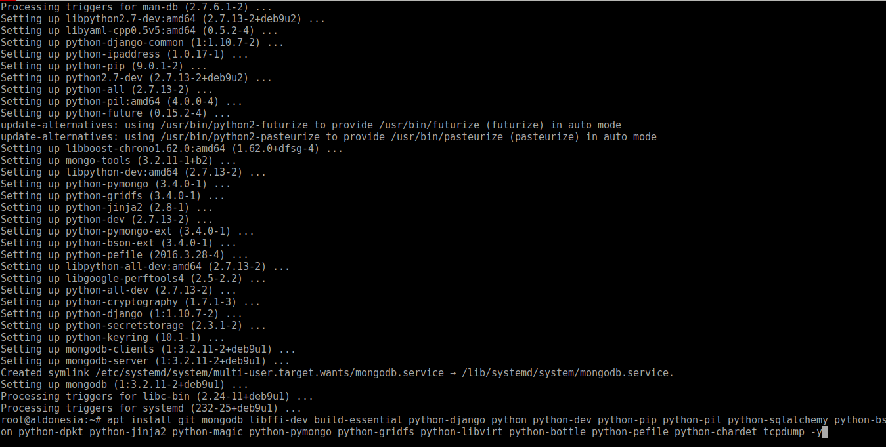

  2. Mengizinkan tcpdump agar dapat diakses oleh root
  ```
  $ setcap cap_net_raw,cap_net_admin=eip /usr/sbin/tcpdump
  ```
 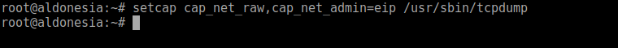
 
  3. menginstall ssdeep
  ```
  $ wget http://sourceforge.net/projects/ssdeep/files/ssdeep-2.12/ssdeep-2.12.tar.gz
  $ tar xvzf ssdeep-2.12.tar.gz
  $ cd ssdeep-2.12
  $ ./configure && make && make install
  $ git clone https://github.com/kbandla/pydeep
  $ cd pydeep
  $ python setup.py build
  $ python setup.py install
  ```
  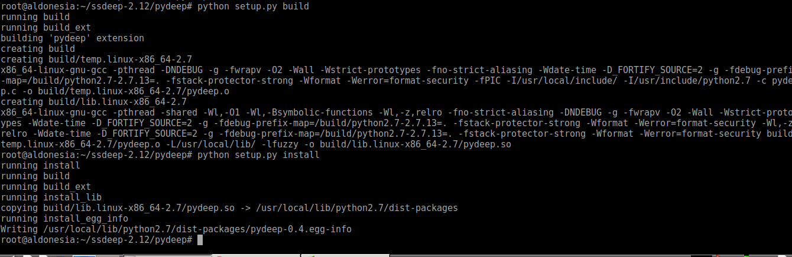
  
  4. install yara
  ```
  $ wget https://github.com/VirusTotal/yara/archive/v3.7.0.tar.gz
  $ ./bootstrap.sh
  $ ./configure --with-crypto --enable-cuckoo --enable-magic
  $ make && make install
  ```
  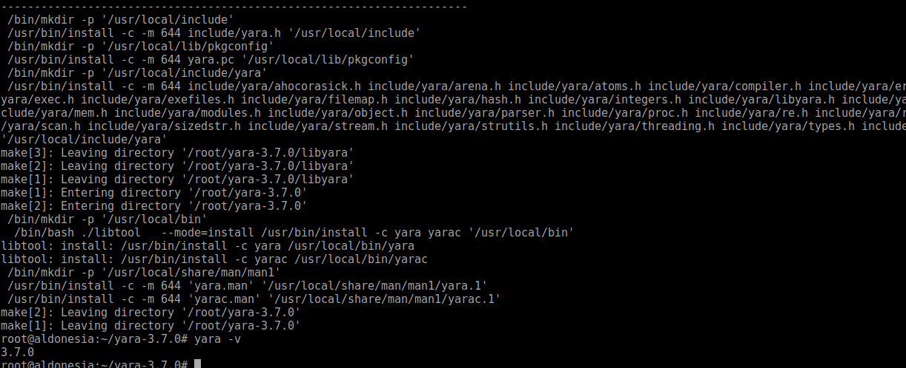
  ```
  $ git clone --recursive https://github.com/VirusTotal/yara-python
  $ cd yara-python
  $ python setup.py build
  $ python setup.py install
  ```
  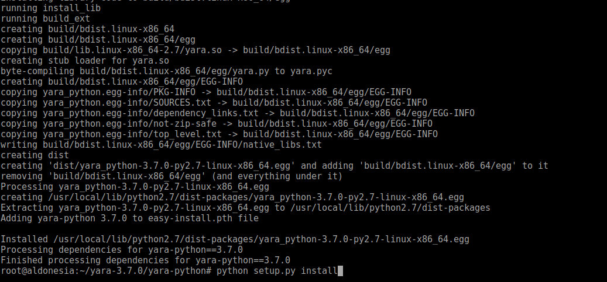
  
  5. install distorm
  ```
  $ wget https://github.com/gdabah/distorm/archive/v3.3.4.tar.gz
  $ tar -xvzf distorm-3.3.4.tar.gz
  $ cd distorm-3.3.4
  $ python setup.py install
  ```
  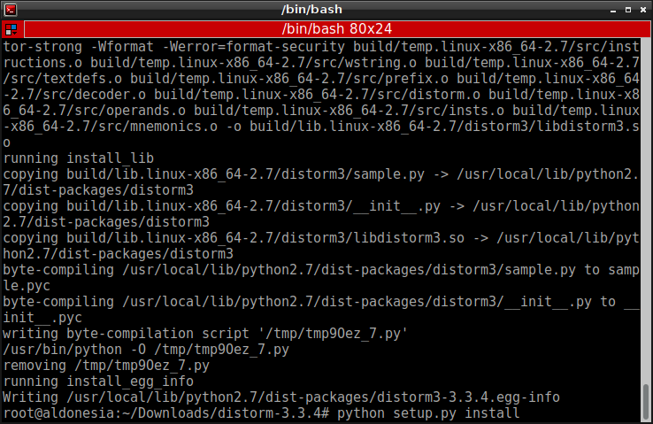
  
  6. install pycrypto
  ```
  $ wget https://pypi.python.org/packages/60/db/645aa9af249f059cc3a368b118de33889219e0362141e75d4eaf6f80f163/pycrypto-2.6.1.tar.gz
  $ tar -xvzf pycrypto
  $ cd pycrypto
  $ python setup.py build
  $ python setup.py install
  ```
  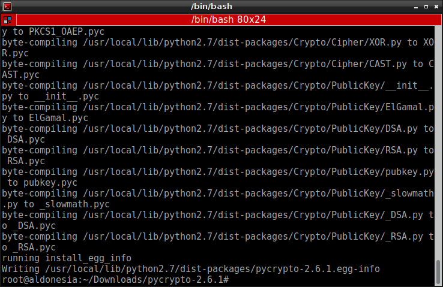
  
  7. Install Volatility
    7.A Install aplikasi prasyarat untuk menginstall volatility
        ```
        $ pip install openpyxl ujson pycrypto jupyter pytz
        ```
        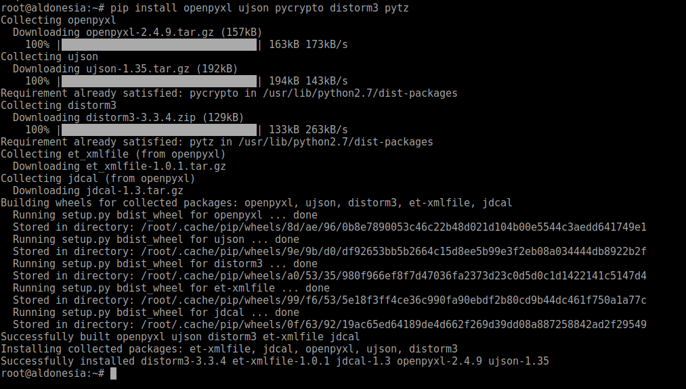
    7.B Install Volatility
        ```
        $ git clone https://github.com/volatilityfoundation/volatility.git
        $ cd volatility
        $ python setup.py build
        $ python setup.py install
        $ python vol.py -h
        ```
        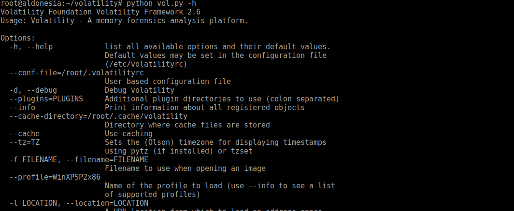
    
  8. Install mitmproxy
  ```
  $ pip3 install mitmproxy
  ```
   
  9. Install Virtualbox
  ```
  apt install virtualbox-5.2
  ```
  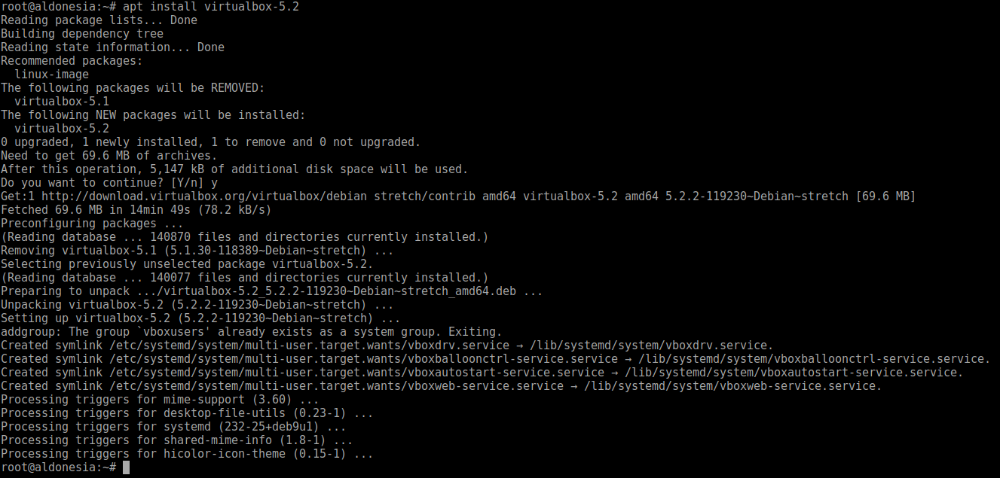
   
## Instalasi Cuckoo
  1. Install Cuckoo
  ```
  $ pip install -U pip setuptools
  $ pip install -U cuckoo
  ```
  
  2. Menambahkan User baru bernama cuckoo
  ```
  $ useradd cuckoo
  ```
  
  3. Buat permission untuk yang bisa mengakses directory cuckoo hanya user cuckoo
  ```
  $ chown -R cuckoo:cuckoo /root/.cuckoo/
  ```
  
  4. Menambahkan user cuckoo kedalam vboxuser group
  ```
  $ usermod -a -G vboxusers cuckoo
  ```
  
  5. Membuat virtual windows xp dan menginstall windows xp
  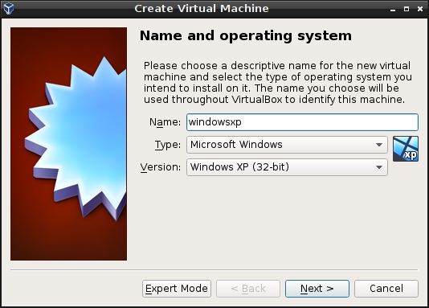
  
  6. Mengatur jaringan virtual windowsxp menjadi set host adapter only
  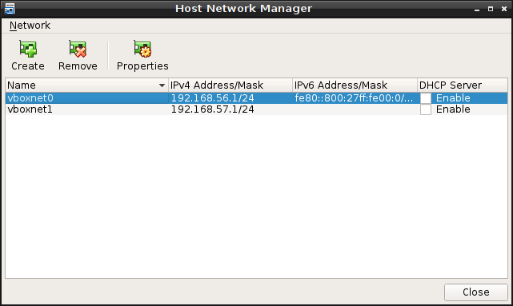
  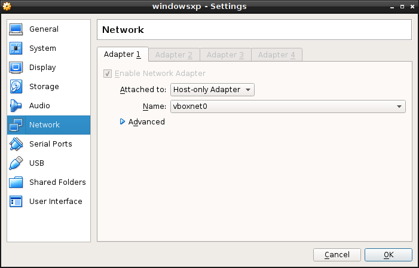
  
  7. Set IP static di windowsxp
  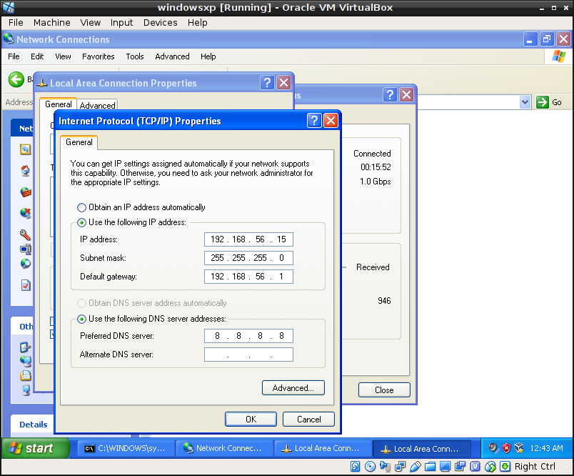
  
  8. set sharedfolder untuk menghubungkan debian dan windowsxp
  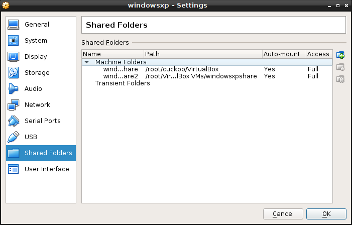
  
  9. set insert guest addition CD untuk dapat mengakses sharedfolder
  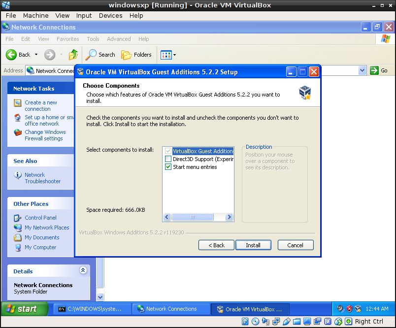
  
  10. matikan windows firewall dan windows update
  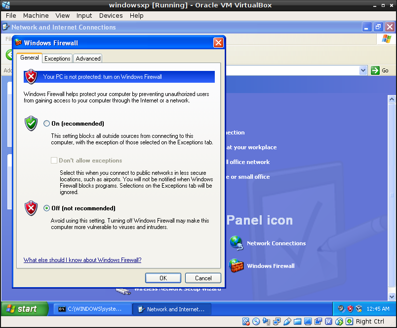
  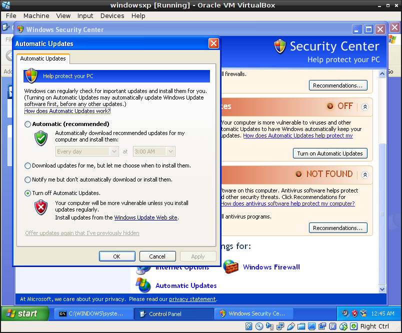
  
  11. install python 2.7 di windowsxp
  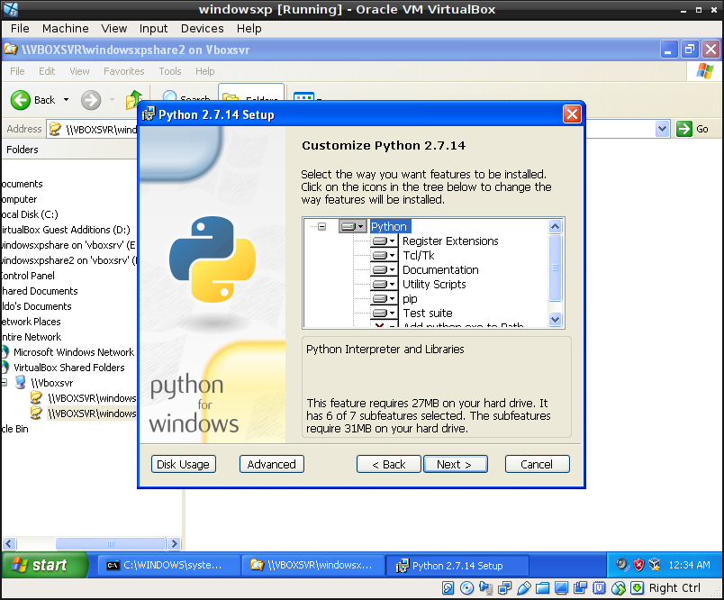
  
  12. start agent.py di windowsxp, agent.py yang dikeluarkan cuckoo terbaru akan tidak mengeluarkan apa apa
  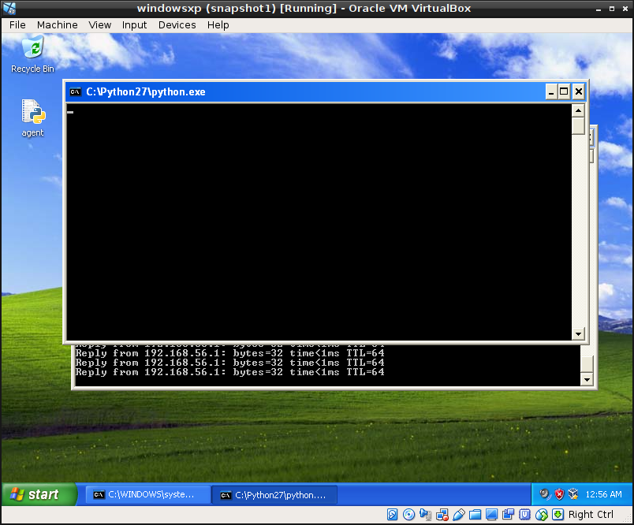
  
  13. mengatur snapshoot di virtual windowsxp melalui cli
  ```
  $ vboxmanage snapshot "windowsxp" take "snapshot1" --pause
  $ vboxmanage controlvm "windowsxp" poweroff
  $ vboxmanage snapshot "windowsxp" restorecurrent
  ```
   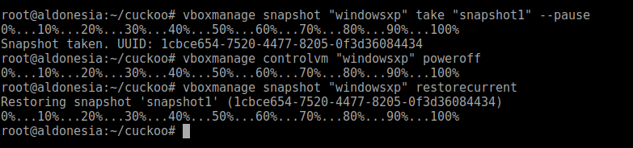
