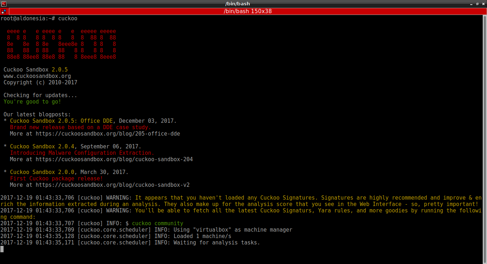

# KONFIGURASI CUCKOO

1. cuckoo .conf
  ```
  $ nano /root/.cuckoo/conf/cuckoo.conf
  
      machinery = virtualbox
      ip = 192.168.56.1
      port = 2042
      memory dump = yes
  ```
  
2. auxiliary.conf
  ```
  $ nano /root/.cuckoo/conf/auxiliary.conf
  
      [sniffer]
      enabled = yes

      tcpdump = /usr/sbin/tcpdump
      mitm = yes
  ```
  
3. virtualbox.conf
  ```
  $ nano /root/.cuckoo/conf/virtualbox.conf
  
      interface = vboxnet0
      machines = windowsxp
      [windowsxp]
      label = windowsxp
      platform = windows
      ip = 192.168.56.10
      snapshot = snapshot1
  ```

4. reporting.conf
  ```
  $ nano /root/.cuckoo/conf/reporting.conf
  
      [mongodb]
      enabled = yes

      html = yes
  ```

5. processing.conf
  ```
  $ nano /root/.cuckoo/conf/processing.conf
  
      memory = yes
  ```
  
# RUN CUCKOO
1. run cuckoo pada cli
  ```
  $ cuckoo
  ```
  

2. run cuckoo pada web melalui cli
  ```
  $ cd /root/.cuckoo/web
  $ cuckoo web runserver
  ```
  lalu akses pada web dengan url 127.0.0.1:8000
