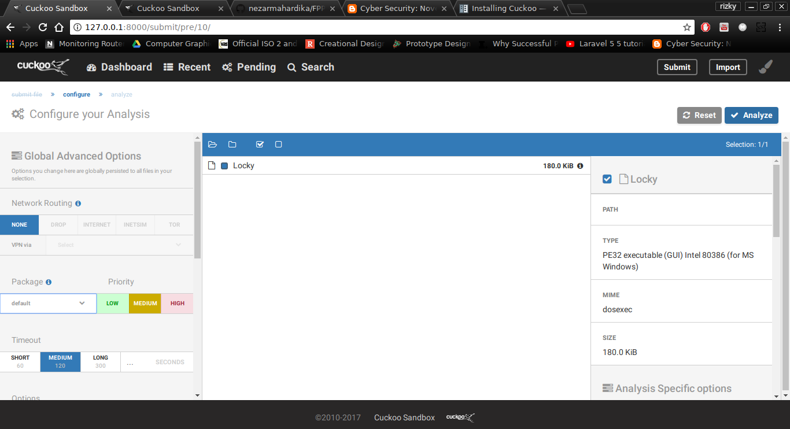
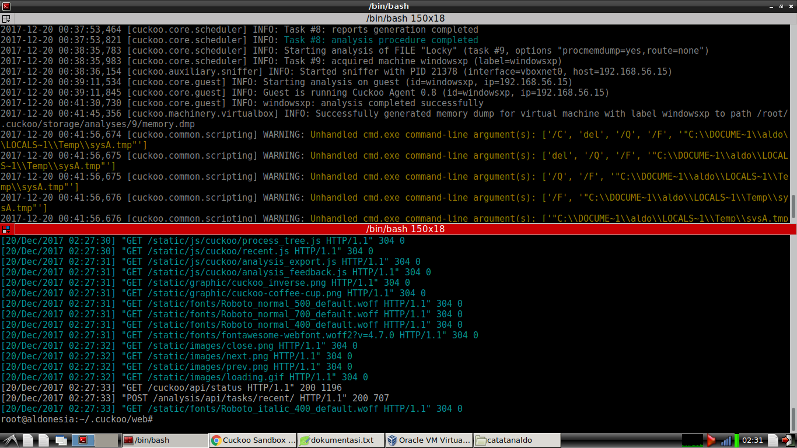
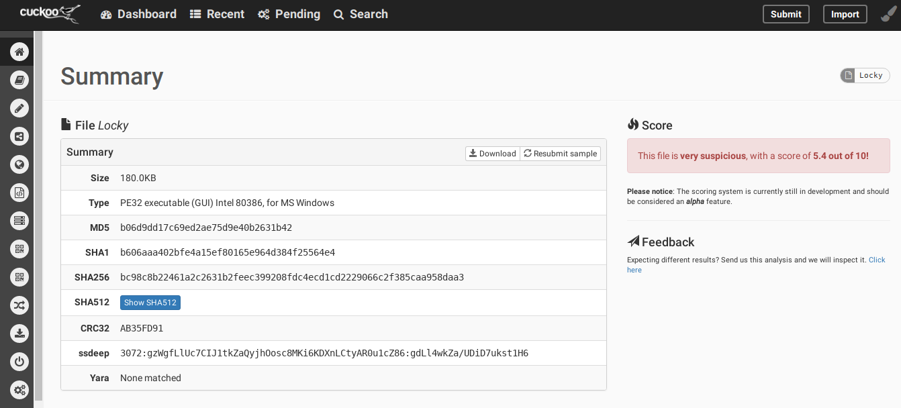
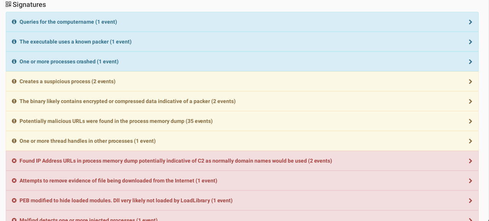
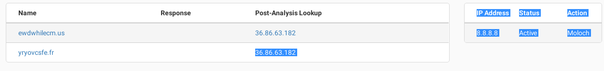
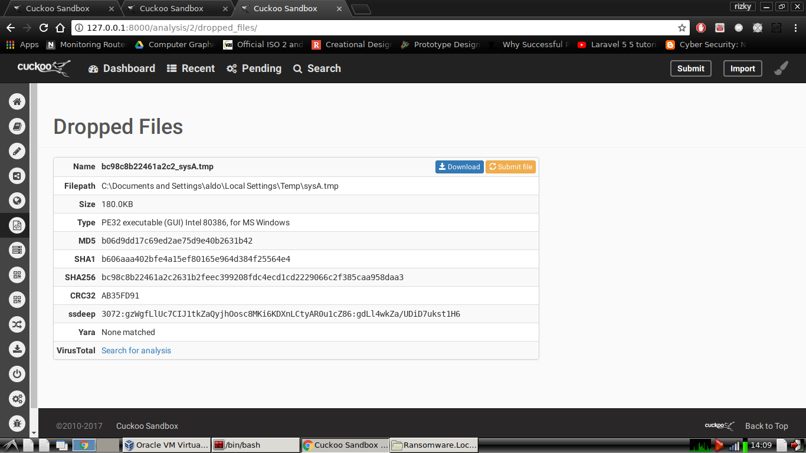
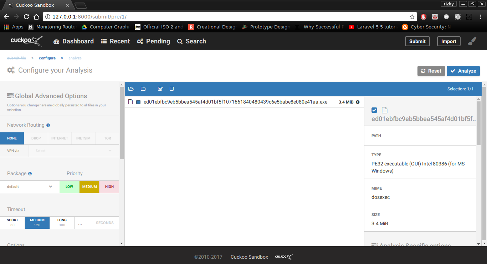
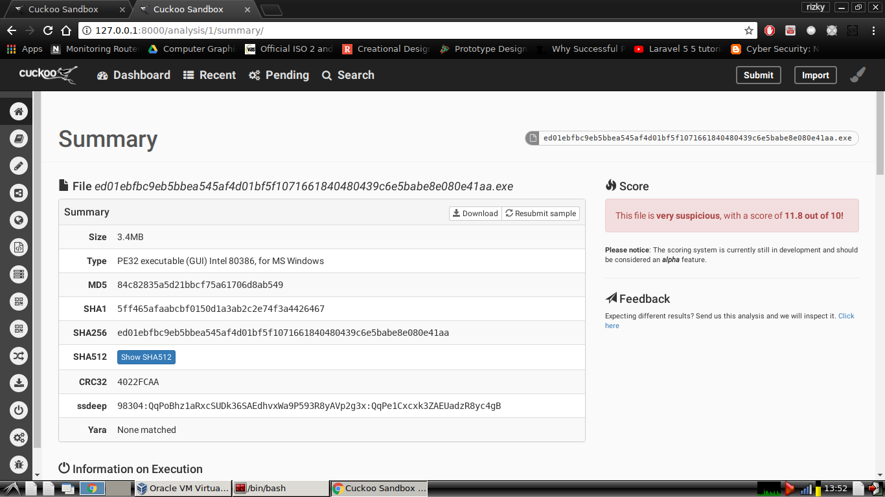
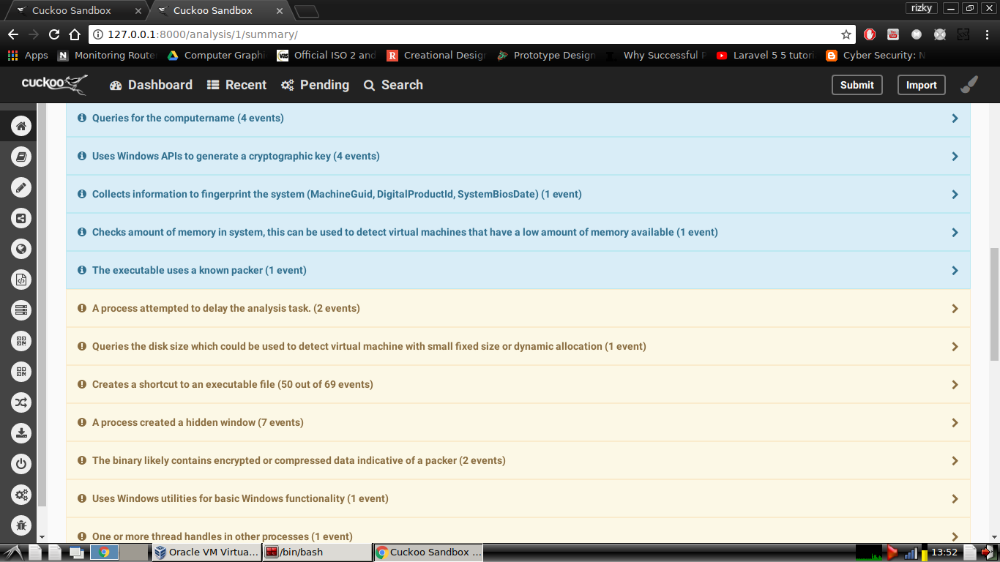
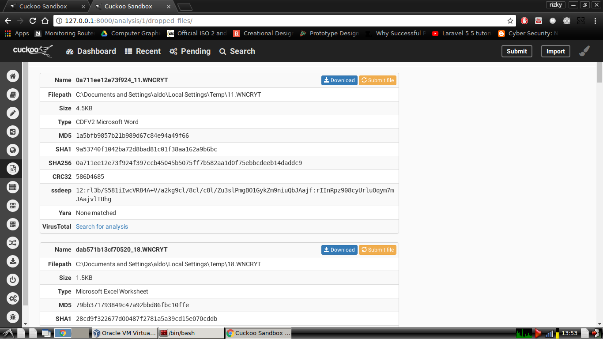

# UJI COBA RANSOMEWARE LOCKY
1. submit file dan analysis file

2. proses pada cli

3. hasil analisis

4. dropped files yang dihasilkan oleh locky

**kesimpulan**
1. ransomware locky membuat file dan menyembukan file sistem secara encrypted by locky.
2. ransomware locky biasa dikirim melalui email atau secara phising dalam memilih targetnya.
3. terfapat koneksi ke gcsbmmrurqva.eu dan xrlfsgaxenf.eu

# UJI COBA RANSOMEWARE WANNACRY
1. submit file dan analysis

2. hasil analisis

3. dropped files yang dihasilkan oleh wannacry

**kesimpulan**
1. ransomeware wannacry menyembunyikan file target dan membuat banyak file wannacry
2. ransomeware wannacry mengganti wallpaper target dengan informasi bahwa target terkena wannacry
3. terdapat banyak dropped files yang dihasilkan
